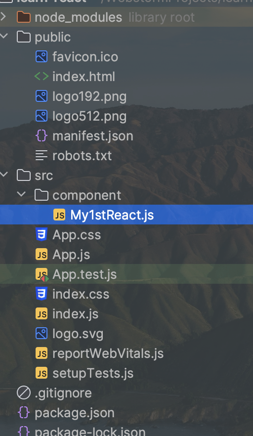

#### React (https://zh-hans.react.dev/)

1. ###### How to create and nest component?

   a. Use ```npx create-react-app project_name``` to provide env for react develop, like ```ng new project_name``` in angular. We get this initial project directory:

   App.js is main file in react, like app.component.ts in angular project, you can choose what component you want to display via add them to it.

   

   b. Any function could be a component it can be reuse any where you want, define once use anywhere.(like JDK, compile once,run anywhere),example below: 

   ###### // Note: component must named starts with CAPS letter

   ```react
   export default function My1stReactComponent() {
     return (
       <h1>Hello Forrest!</h1>
     );
   }
   // or this way, The default keyword can be omitted, but in same file can only have 1 
   // default function
   export function My1stReactComponent() {
     return (
       <h1>Hello Forrest!</h1>
     );
   }
   ```

2. ###### How to pass props to other component

   ```react
   export default function My1stReact() {
       const data = {
           name: 'Forrest',
           age: 26
       }
       return (
         // <Component_name need_pass_data={real_data} />
           <><My2rdReact data={data}/></>
       )
   }
   
   export function My2rdReact(props) {
       const {name, age}= props.data;
       return (
           <>
               <h1> I'm {name}!</h1>
               <br/>
               <h2>I'm {age} !</h2>
           </>
       )
   }
   ```


4. ###### How to choose what content to display

   You can choose index.js in root directory then add js file what you want to display.

5. ###### How to respond to events and update the screen

6. ###### How to share data between components